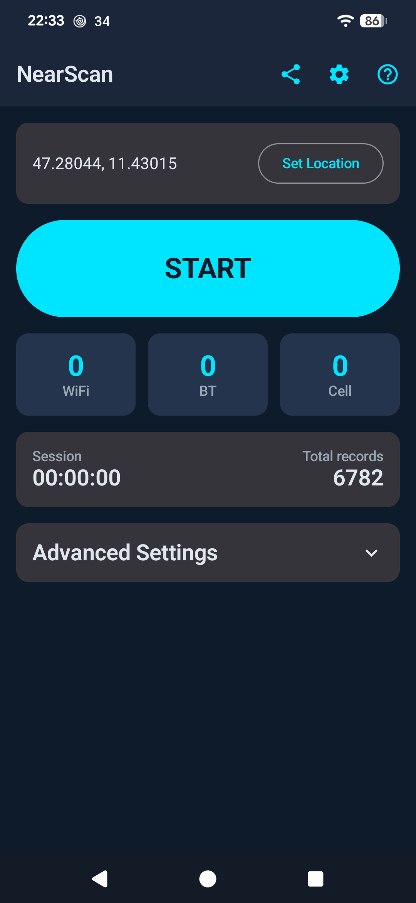
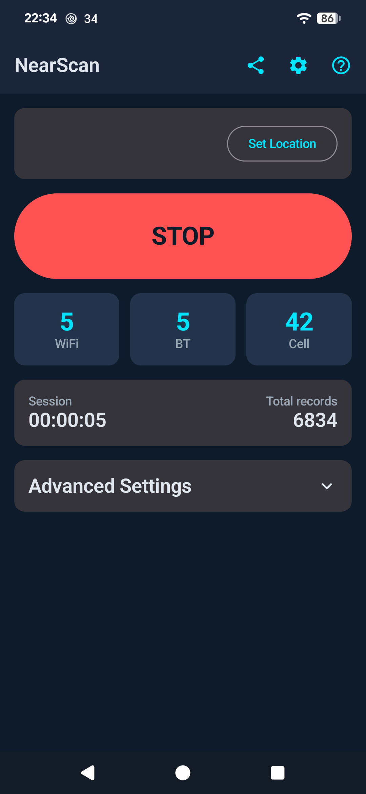
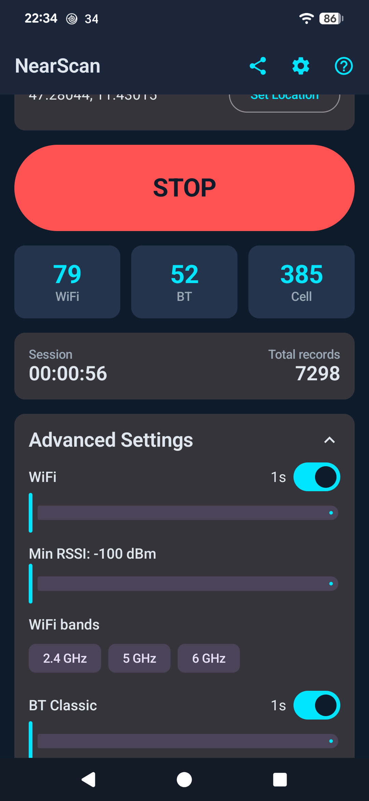
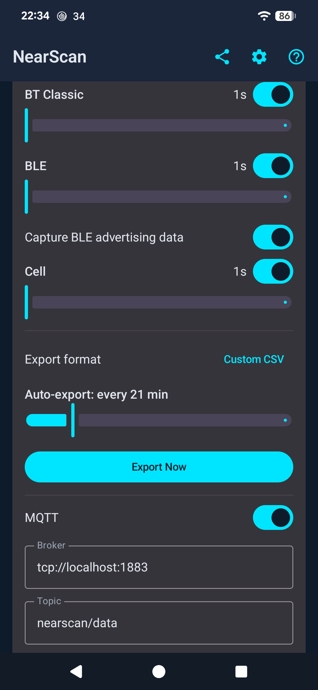
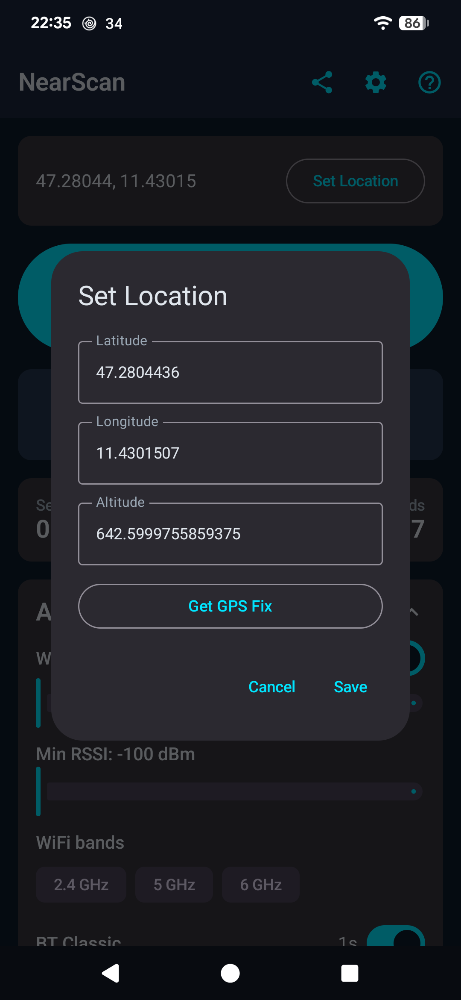

<div align="center">

# NearScan

**A battery-friendly Android RF environment logger — WiFi, Bluetooth & cell towers, no GPS drain.**

[](LICENSE)
[](https://github.com/designer2k2/nearscan/releases)
[](#install)
[](#tech-stack)

No ads · no account · no analytics · no trackers · nothing leaves your device unless you send it

</div>

---

NearScan logs the RF environment around a **fixed location** — nearby WiFi networks, Bluetooth
devices, and cell towers — over long stationary sessions (hours or days) without burning battery
on continuous GPS.

Set your location once (type it in, or grab a single GPS fix that immediately switches GPS back
off), tap **START**, and NearScan keeps scanning in the background — stamping every result with
that location — for as long as you need.

It's built for people who want to characterise the RF environment at a stationary point: at home,
at a monitoring station, during a site survey, or outdoors with a power bank.

> NearScan is **not affiliated with WiGLE**, but exports a WiGLE-compatible CSV by default because
> it's a well-known open format used by wardriving and site-survey tools.

## Screenshots

| Main screen | Live scanning | Scan types & intervals | Export & MQTT | Set location |
|:-:|:-:|:-:|:-:|:-:|
|  |  |  |  |  |

## Table of contents

- [Features](#features)
- [Privacy](#privacy)
- [Permissions explained](#permissions-explained)
- [Install](#install)
- [Building from source](#building-from-source)
- [Usage](#usage)
- [Automation (Tasker / MacroDroid / …)](#automation)
- [Data storage & retention](#data-storage--retention)
- [Tech stack](#tech-stack)
- [Contributing](#contributing)
- [License](#license)

## Features

- **Four scan types, independently toggleable** — WiFi, Bluetooth Classic, Bluetooth LE, and cell
  towers (GSM / LTE / WCDMA / NR), each with its own configurable interval.
- **GPS-free by design** — your location is set once and reused; the GPS radio is only touched for
  the single moment you tap *Get GPS Fix*, then turned straight back off. No continuous tracking.
- **Live-reactive settings** — toggle a scan type or drag an interval slider mid-session and it
  takes effect immediately, no stop/restart.
- **Proper foreground service** — persistent notification with live counts, elapsed time, and a
  direct **Stop** action; holds a wake lock so scanning survives with the screen off.
- **Battery-optimisation exemption prompt** (user-triggered only) so Doze doesn't suspend
  multi-day sessions.
- **WiFi filtering** — by minimum signal strength and by band (2.4 / 5 / 6 GHz).
- **Export formats** — WiGLE-compatible CSV, full-schema Custom CSV, GeoJSON, or a raw SQLite
  dump. All gzip-compressed, shareable straight from the export dialog via Android's share sheet.
- **MQTT publishing** (optional) — stream results live to *your own* broker, e.g. for Home
  Assistant or Grafana.
- **Optional extra fields** — battery level / charging / temperature, screen state, network state,
  compass heading / tilt, scan duration, available memory; each toggled individually, off by
  default.
- **Deduplication** (optional) — skip re-logging the same network/device within ±3 dBm of its
  last logged value.
- **Automation integration** — control NearScan and react to scan events from Tasker, MacroDroid,
  Automate, or any app, via standard Android broadcasts and a read-only `ContentProvider`. No
  proprietary plugin. Full reference built into the app (**?** icon).
- **Resilient to reboots and OS kills** — detects an interrupted session on next launch and
  offers to resume it.
- **10 languages** — English, Spanish, Chinese (Simplified), Hindi, Portuguese (Brazil), Russian,
  Japanese, German, French, Korean.

## Privacy

NearScan has **no backend server**. There is no analytics SDK, no crash-reporting SDK, and no
advertising SDK in the app.

All scan results are stored in a local database on your device. Data leaves your device **only**
when you take an explicit action:

| Action | What happens |
|---|---|
| **Export** | You pick a destination (email, messaging, cloud storage…) through Android's own share sheet. NearScan doesn't see or control what happens next. |
| **MQTT** (off by default) | If you enable it and enter a broker address you control, scan results are streamed there. The developer never operates or has access to any broker. |
| **Automation** (opt-in) | Automation apps you install can query your scan data on-device via the `ContentProvider`. No network is involved. |

Full policy: **[docs/privacy-policy.html](docs/privacy-policy.html)**
· Data Safety / Play Console notes: [docs/play-store-listing.md](docs/play-store-listing.md)

## Permissions explained

NearScan asks for exactly what its scan types need and nothing more. Every permission below is
either required by Android to return scan results, or is what keeps a long session alive. If you
deny an optional one, the corresponding feature simply switches off — the rest of the app keeps
working.

### Runtime permissions (you're prompted for these)

| Permission | Why NearScan needs it | What it is **not** used for | If denied |
|---|---|---|---|
| `ACCESS_FINE_LOCATION` + `ACCESS_COARSE_LOCATION` | Android requires location access before it will return **any** WiFi or Bluetooth scan results. Also used for the optional single GPS fix. | No continuous location tracking. GPS is off except for the one moment you tap *Get GPS Fix*. NearScan never polls your position in the background. | WiFi and Bluetooth scanning cannot work; cell scanning also needs it. The app tells you which scan types are affected. |
| `BLUETOOTH_SCAN` | Discover nearby Bluetooth Classic and BLE devices (address, name, RSSI, and — if you opt in — advertised service UUIDs and manufacturer data). | Not used to connect to, pair with, or transfer data to/from any device. | Bluetooth Classic and BLE scanning are disabled. |
| `BLUETOOTH_CONNECT` | Required by Android 12+ to read a discovered device's name alongside its address during a scan. | No pairing, no connections, no data exchange — name lookup only. | BLE device **names** may be blank; scanning otherwise continues. |
| `READ_PHONE_STATE` | Read **cell-tower metadata** via `TelephonyManager.getAllCellInfo()` — carrier codes (MCC/MNC), cell ID, LAC/TAC, radio technology, and signal quality. Android gates this API behind `READ_PHONE_STATE` on current OS versions. | **Never** your phone number, IMEI/IMSI, SIM serial, contacts, call log, or call state. NearScan has no telephony features beyond reading nearby tower info. See [`CellScanner.kt`](app/src/main/java/at/designer2k2/nearscan/scanner/CellScanner.kt). | Cell-tower scanning is disabled; WiFi/Bluetooth scanning and everything else keep working. |
| `POST_NOTIFICATIONS` (Android 13+) | Show the ongoing scan-session notification (live counts, elapsed time, Stop button). Android requires a foreground service to post a notification. | No promotional or re-engagement notifications — only the one for an active session. | The session still runs, but Android may suppress the notification. |

### Install-time / special-access permissions (no prompt, or a one-tap system dialog)

| Permission | Why NearScan needs it | Notes |
|---|---|---|
| `ACCESS_WIFI_STATE`, `CHANGE_WIFI_STATE` | Trigger a WiFi scan and read its results. | `CHANGE_WIFI_STATE` here only permits *starting a scan* — it does not turn WiFi on/off or change networks. |
| `FOREGROUND_SERVICE`, `FOREGROUND_SERVICE_LOCATION` | Run the scan service reliably for hours or days with the screen off. The `location` type is declared because every logged record is tied to the location you set. | The service **only** starts when you tap START. It never starts itself in the background. |
| `WAKE_LOCK` | Keep the CPU awake during a scan cycle so sessions don't stall when the screen is off. | A partial wake lock — the screen stays off. |
| `RECEIVE_BOOT_COMPLETED` | Detect that a reboot interrupted an active session, so the app can offer to resume it on next launch. | Nothing is scanned automatically after boot; you're only shown a prompt. |
| `REQUEST_IGNORE_BATTERY_OPTIMIZATIONS` | Let you exempt NearScan from Doze / App Standby so long stationary sessions aren't frozen. | **User-triggered only**, via the banner on the main screen. Never requested automatically. |
| `INTERNET` | Used **only** if you turn on optional MQTT streaming to a broker you configure. | With MQTT off, the app makes no network connections at all. |
| `ACCESS_NETWORK_STATE` | Read which transport (WiFi / cellular / none) is currently active, for the optional "mobile data active" and "network type" extra logged fields. | Only read when you enable those extra fields; no connection is made. |
| `WRITE_EXTERNAL_STORAGE` (`maxSdkVersion="28"`) | Write export files on Android 9 and older, which predate scoped storage. | Not requested on Android 10+. |
| `at.designer2k2.nearscan.permission.READ_DATA` | A **custom** permission other apps (e.g. Tasker) must hold to query NearScan's read-only data provider. | `normal` protection level — it's a namespace guard, not a security boundary. Granted silently to any app that declares it. |

## Install

**GitHub Releases** — grab the latest signed APK from the
[Releases page](https://github.com/designer2k2/nearscan/releases) and sideload it. (You'll need
to allow "install unknown apps" for your browser or file manager.)

**Google Play** — [`at.designer2k2.nearscan`](https://play.google.com/store/apps/details?id=at.designer2k2.nearscan).

**F-Droid** — submission in progress. Fastlane metadata lives in
[`fastlane/metadata/`](fastlane/metadata/android/en-US); the build recipe and the step-by-step
process are in [`docs/fdroid/`](docs/fdroid/SUBMISSION.md).

**Build it yourself** — see below.

## Building from source

Requirements: **JDK 17** and the Android SDK (compile/target SDK **36**).

```bash
export JAVA_HOME=/path/to/jdk-17
export ANDROID_HOME=/path/to/android-sdk

# Debug APK  ->  app/build/outputs/apk/debug/
./gradlew assembleDebug

# Release APK (minified + resource-shrunk)  ->  app/build/outputs/apk/release/
./gradlew assembleRelease

# App bundle  ->  app/build/outputs/bundle/release/
./gradlew bundleRelease

# Unit tests
./gradlew testDebugUnitTest
```

Release builds are signed only if a `keystore.properties` file exists at the repo root (it's
git-ignored); without it, `assembleDebug` and the tests still work with no keystore present.

Toolchain: AGP 9.1 · Gradle 9.4 · Kotlin 2.3 · Hilt (KSP) · Room. Version numbers live in
[`gradle/libs.versions.toml`](gradle/libs.versions.toml).

## Usage

1. **Set your location** — tap *Set Location*, type in latitude / longitude / altitude, or tap
   *Get GPS Fix* for a single fix. This is stamped onto every record.
2. **Pick scan types and intervals** — expand *Advanced Settings*. Each of WiFi / BT Classic /
   BLE / Cell can be toggled and given its own interval. Change them any time, even mid-session.
3. **Tap START** — the foreground notification appears and counters begin to climb. The screen
   can go off; the session keeps running.
4. **Tap STOP** when done, then **Export Now** (or the share icon) to get your data out.

### Export formats

| Format | Contents |
|---|---|
| **WiGLE CSV** (default) | Fixed WiGLE schema — MAC, SSID, auth, channel, RSSI, lat/lon/alt, type. Compatible with WiGLE tooling. |
| **Custom CSV** | Every field, including any optional extra fields you enabled. Self-documenting header row. |
| **GeoJSON** | `FeatureCollection` of points — drop straight into QGIS, Leaflet, or Mapbox. |
| **SQLite dump** | The raw Room database file. Full fidelity, queryable with any SQLite tool. |

All exports are gzip-compressed (`.gz`).

### MQTT

Enable it in *Advanced Settings*, enter your broker URL (`tcp://host:1883`) and a topic. NearScan
publishes one JSON payload per scan result. Connection reacts live — enabling mid-session
connects immediately.

## Automation

NearScan exposes standard Android IPC so automation apps can drive it and react to it — **no
proprietary plugin**. Package name: `at.designer2k2.nearscan`.

| Direction | Mechanism | Examples |
|---|---|---|
| App → automation | `Intent` received | `SCAN_STARTED`, `SCAN_STOPPED`, `NEW_WIFI_FOUND`, `NEW_BT_FOUND`, `NEW_BLE_FOUND`, `NEW_CELL_FOUND`, `ROUND_COMPLETE`, `EXPORT_COMPLETE` |
| Automation → app | Send `Intent` (with `package` set) | `CMD_START`, `CMD_STOP`, `CMD_TOGGLE`, `CMD_EXPORT`, `CMD_SET_LOCATION`, `CMD_SET_INTERVAL`, `CMD_CLEAR_DATA` |
| Automation → app | Content query | `content://at.designer2k2.nearscan.provider/{wifi,bt,cell,stats}` |

All action strings are prefixed `at.designer2k2.nearscan.`. Full details — every extra, every
column, and worked Tasker recipes — are in the **in-app Help screen** (the **?** icon) and in
[`CLAUDE.md`](CLAUDE.md).

## Data storage & retention

- Everything is stored locally in a Room/SQLite database (`nearscan.db`).
- On each new session start, records **older than 30 days** are purged automatically.
- **Clear Data** in *Advanced Settings* wipes everything immediately.
- Uninstalling removes all data — there is no server-side copy.

## Tech stack

Kotlin · Jetpack Compose · MVVM + Clean Architecture · Hilt · Room · DataStore · Coroutines ·
Eclipse Paho MQTT client. Min SDK 26 (Android 8.0), target SDK 36.

Architecture, module layout, and implementation notes: **[CLAUDE.md](CLAUDE.md)**.

## Contributing

**Everything is welcome** — bug reports, feature ideas, translations, docs fixes, screenshots,
testing on your device, or code. No CLA, no perfect-PR requirement, first-timers encouraged. If
you're unsure whether something fits, open an issue and ask, or just open a draft PR.

See **[CONTRIBUTING.md](CONTRIBUTING.md)** for the (short, low-friction) details.

## License

[MIT](LICENSE) © 2026 Stephan Martin

NearScan is not affiliated with, endorsed by, or connected to WiGLE. You are responsible for
using the app in compliance with the laws and regulations that apply where you are.
